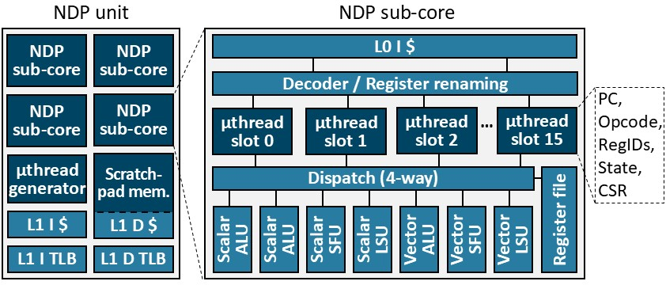

# Simulator for Memory-Mapped Near-Data Processing (M²NDP)

This is a cycle-level simulator developed to model the M²NDP architecture proposed in the paper, *Low-overhead General-purpose Near-Data Processing in CXL Memory Expanders, MICRO'24*.

### Here are some high-level features of the M²NDP architecture:
- **General-purpose NDP for CXL memory**: Enables general-purpose (rather than application-specific) NDP in CXL memory for diverse real-world workloads.
- **Low-overhead offloading**: Supports low-overhead NDP offloading and management with **M²func (Memory-Mapped function)**.
- **Cost-effective NDP unit design**: The **M²μthread (Memory-Mapped μthreading)** execution model based on an extended RISC-V vector extension efficiently utilizes resources to maximize concurrency.

For more details, check out our paper available at [arXiv](https://arxiv.org/pdf/2404.19381).


## Requirements

### OS Distribution
Recommended: CentOS 8

### Tested Environment
```bash
gcc == 8.3.0 (for accelsim build, 7.3.0)
g++ == 8.3.0 (for accelsim build, 7.3.0)
cmake == 3.22.1
conan == 1.56.0
python >= 3.6
```
Our provided Docker environment resolves software dependencies.

### Hardware Dependencies
Any x86 hardware capable of running Docker with more than 60 GB of memory and 60 GB of available disk space.

## Hardware Configuration



`config` directory contains example NDP configuration files.

You can configure the number of NDP units, sub-cores, caches, TLBs, and functional units in an M²NDP system.
```bash
ramulator_config=./LPDDR5-config.cfg  #Ramulator configuration path
cxl_link_config=./cxl_link.icnt #CXL booksim configuration path
local_cross_bar_config=./memory_buffer_crossbar.icnt # Crossbar booksim configuration path
functional_sim=1 # 1: enable functional simulation, 0: skip functional simulation
num_sub_core=4 # Number of subcores
num_ndp_units=32 # Number of ndp units
spad_size=131072 # in Bytes
#Cache and TLB configuraitons
l1d_config=S:64:128:16,L:T:m:L:L,A:384:48,16:0,32 
l2d_config=S:64:128:16,L:B:m:L:L,A:192:4,32:0,32
l0icache_config=N:32:32:4,L:R:f:N:L,A:2:4,32:0,32
l1icache_config=N:32:128:4,L:R:f:N:L,A:2:4,32:0,32
dtlb_config=N:32:32:8,L:R:f:N:P,A:2:4,32:0,128
itlb_config=N:32:32:4,L:R:f:N:L,A:2:4,32:0,32
max_kernel_launch=64
uthread_slots=16 # number of uthread slots per sub-core
#number of functional units
num_v_f_units=1
num_v_ldst_units=4
num_v_spad_units=4
#Frequency: Host core, Host DRAM, NDP core, CXL link, NDP cache, NDP DRAM
freq=2000,2000,2000,8000,2000,800
```

## Getting Started
### Build

To build the Docker image and set up the environment, use the following commands:

```bash
# Build the Docker image
docker build . -t m2ndp

# Run the Docker container
docker run -it --ipc=host m2ndp:latest bash

# Navigate to the m2ndp directory
cd m2ndp

# Build for functional-only simulation
./scripts/build_functional.sh

# Build for timing simulation
./scripts/build_timing.sh
```
### Artifact evaluation
To generate traces for some specific NDP kernels, comment out the Python commands for the other kernels in make_traces.sh before running it.
```bash
#trace generation
./scripts/make_traces.sh
```
To run only specific NDP kernels, comment out the other kernels from `JOB_LIST` in run_simulations.sh. By default, the script runs simu-
lation of one NDP kernel at a time. If the machine has a sufficient number of CPU cores and memory capacity, multiple kernel simulations can be run simultaneously by increasing the value of `MAX_PROCESSES` in this script.
```bash
# Run simulations
./scripts/run_simulations.sh
```

Run the following command to aggregate results and generate the figures. To report speedups over baselines, it will use CPU and GPU baseline results provided in CSV and script files. The figures will be stored under ./outputs.
```bash
# Aggregate results and generate figures
./scripts/aggregate_results.sh
```

### Functional only simulation

To run a functional-only simulation for a given NDP kernel, use the following command:

```bash
./build/bin/Funcsim --ndp_trace {path for ndp kernel trace}         \
          --memory_map {path for input memory map file}   \
          --target_map {path for target memory map file}  \
          --launch_file {path for kernel launch file}     \
          --config ./config/functional_only/m2ndp.config
```

Replace `{path for ndp kernel trace}`, `{path for input memory map file}`, `{path for target memory map file}`, and `{path for kernel launch file}` with the appropriate file paths for your simulation.

### Standalone Performance Simulation

To run a standalone performance simulation for a given NDP kernel using the M2NDP configuration, use the following command:

```bash
./build/bin/NDPSim --trace {path for ndp input file directory}    \
          --num_hosts 1  --num_m2ndps 1                  \
          --config ./config/performance/M2NDP/m2ndp.config
```

Replace `{path for ndp input file directory}` with the appropriate directory path for your simulation.

## Citation
If you use this simulator for your research, please cite the following paper.
```
@INPROCEEDINGS{ham2024low,
  author={Ham, Hyungkyu and Hong, Jeongmin and Park, Geonwoo and Shin, Yunseon and Woo, Okkyun and Yang, Wonhyuk and Bae, Jinhoon and Park, Eunhyeok and Sung, Hyojin and Lim, Euicheol and Kim, Gwangsun},
  title={Low-overhead General-purpose Near-Data Processing in CXL Memory Expanders},
  booktitle={2024 57th IEEE/ACM International Symposium on Microarchitecture (MICRO)}, 
  volume={},
  number={},
  pages={594-611},
  year={2024},
  doi={10.1109/MICRO61859.2024.00051}
}
```
